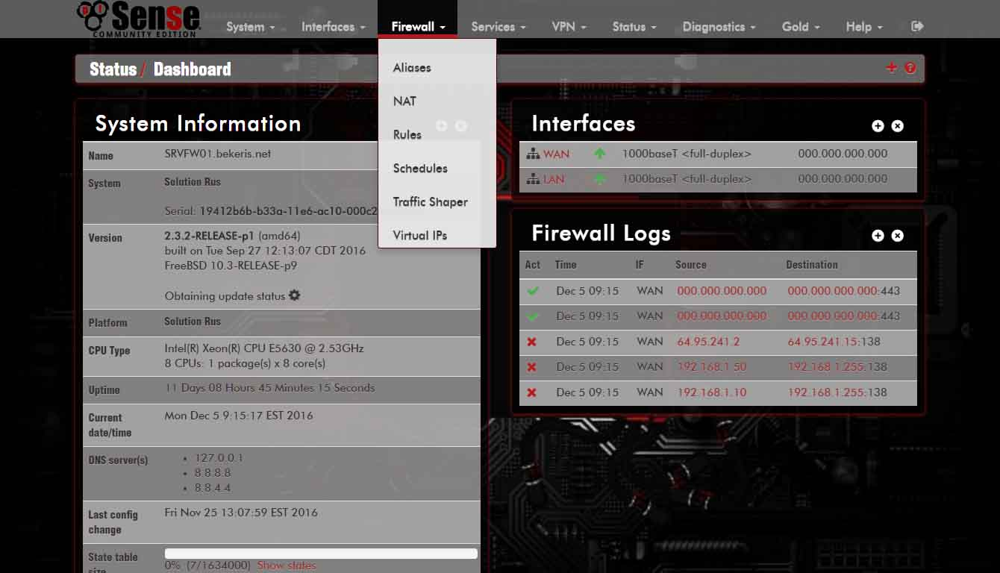

# Tema para pfSense 

## pfSense-red.Dark

### Instalacion 

Descargar o clonar  descomprimir el archivo pfSense-red.Dark.zip  en el directorio css de
la plataforma web de su sistema pfSense luego dirigirse al menu "Sistem" opcion "General Setup" luego en la opcion  
theme elegir el tema pfSense-red.Dark luego presional el boton guardar 

